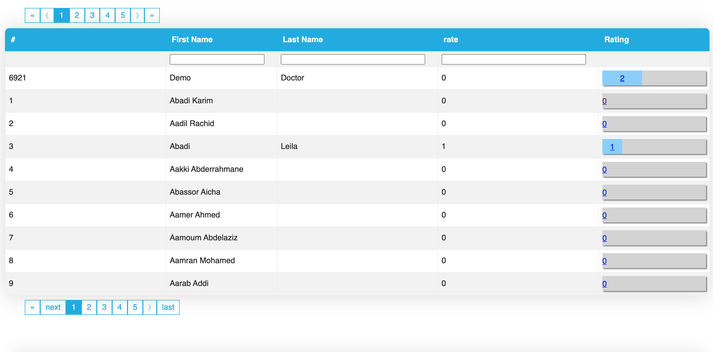

# react-datable

react-datable is a lightweight, fast and extendable datagrid built for React

<p align="center">


 


</p>

<div align="center">
  <sub>Created by <a href="https://github.com/jamalhassouni">Jamal Hassouni</a> and maintained with ❤️ by an amazing <a href="https://github.com/jamalhassouni/react-datable/graphs/contributors">team of developers</a>.</sub>
</div>

## Table of Contents

- [What is react-datable ?](#react-datable)
- [Table of Contents](#Table-of-Contents)
- [Features](#Features)
- [Screenshot](#demo)
- [Installation](#Installation)
- [react-datable Props](#LaraTable-Props)
- [Headers Props](#LaraTable-Headers-Props)
- [Accessors](#Accessors)
- [Custom Cell And Header](#Custom-Cell-And-Title-Rendering)
- [Pagination Props](#Pagination-Props)
- [Contributing](#Contributing)
- [Changelog](#changelog)
- [License](#license)

## Features

- Lightweight
- Fully customizable (JSX, templates, state, styles, callbacks)
- Client-side & Server-side pagination
- Multi-sort
- Filters
- Minimal design & easily themeable
- Fully controllable via optional props and callbacks

## demo


### Basic



### Custom cell


### Custom Headers and accessor


## Installation

---

```
npm i react-datable
```

## usage

```js
import React from "react";
import "./App.css";
import LaraTable from "react-datable";

class App extends Component {
  constructor(props) {
    super(props);
    this.state = {
      headers: [
        {
          title: <button>id</button>,
          accessor: "id",
          index: 1,
          sortable: false,
          style: {
            textAlign: "center",
          },
          //dataType: "number",
        },
        { title: "#", accessor: "id", index: 2, dataType: "number" },
        {
          title: "First Name",
          accessor: "first_name",
          width: "200",
          index: 3,
          searchable: true,
          dataType: "string",
        },
        {
          title: "Last Name",
          searchable: true,
          accessor: (d) => d.last_name,
          width: "300",
          index: 4,
          dataType: "function",
        },
        {
          title: "username",
          // accessor: "username",
          accessor: (d) => (
            <span>
              name <i>{d.username}</i>
              <a href="#"> link</a>
            </span>
          ),
          width: "300",
          index: 5,
          searchable: true,
          dataType: "function",
        },
        {
          title: "rate",
          searchable: true,
          accessor: "doctor.average",

          width: "300",
          index: 6,
        },
        {
          title: "Rating",
          accessor: "doctor.avg_rate",
          searchable: false,
          index: 7,
          width: "200",
          cell: (row) => {
            return (
              <div className="rating">
                <div
                  style={{
                    backgroundColor: "lightskyblue",
                    textAlign: "center",
                    height: "1.9em",
                    width: (row.doctor.avg_rate / 5) * 201 + "px",
                    margin: "3px 0 4px 0",
                  }}
                >
                  <a href={`/showchart/${row.id}`}>{row.doctor.avg_rate}</a>
                </div>
              </div>
            );
          },
        },
      ],
      data: [],
      current_page: 1,
      last_page_url: null,
      next_page_url: null,
      per_page: 5,
      totalItemsCount: 5,
      from: null,
      to: null,
    };
  }

  onUpdateTable = (field, id, value) => {
    console.log(field, id, value);
    let data = this.state.data.slice();
    let updateRow = this.state.data.find((d) => {
      return d["id"] === id;
    });

    console.log("updateRow", updateRow);

    updateRow[field] = value;

    this.setState({
      edit: null,
      data: data,
    });
  };

  search = async (pageNumber = 1) => {
    try {
      let searchURL = `http://localhost:8000/api/search?page=${pageNumber}`;
      const response = await fetch(searchURL, {
        method: "POST",
        headers: {
          Accept: "application/json",
          "Content-Type": "application/json",
          "Access-Control-Allow-Origin": "*",
          "X-Requested-With": "XMLHttpRequest",
        },
      });
      const data = await response.json();
      if (data.error === false) {
        return data.data;
      } else {
        return {};
      }
    } catch (err) {
      console.error("error", err);
    }
  };
  async componentDidMount() {
    let res = await this.search();
    this.setState({
      data: res.data,
      current_page: res.current_page,
      last_page_url: res.last_page_url,
      next_page_url: res.next_page_url,
      per_page: res.per_page,
      totalItemsCount: res.total,
      from: res.from,
      to: res.to,
    });
  }

  /***
   * Handle Page Change
   */
  handlePageChange = async (pageNumber) => {
    let res = await this.search(pageNumber);
    this.setState({
      data: res.data,
      current_page: pageNumber,
    });
  };
  render() {
    const pagination = {
      enabled: true,
      itemsCountPerPage: this.state.per_page,
      position: ["bottom left", "top left"],
      pageRangeDisplayed: 5,
      onPageChange: this.handlePageChange,
      currentPage: this.state.current_page,
      prevPageText: "next",
      lastPageText: "last",
    };
    return (
      <div>
        <LaraTable
          keyField="id"
          edit={true}
          pagination={pagination}
          width="100%"
          headers={this.state.headers}
          data={this.state.data}
          noData="No records!"
          onUpdate={this.onUpdateTable}
          totalItemsCount={this.state.totalItemsCount}
          //searchable
        />
      </div>
    );
  }
}
export default App;
```

## LaraTable Props

| Name              | Type     | Default | Description                                                                                     |
| ----------------- | -------- | ------- | ----------------------------------------------------------------------------------------------- |
| `keyField`        | String   | id      | Primary key (used for edit data)                                                                |
| `edit`            | Boolean  | false   | Data can be modified or not                                                                     |
| `totalItemsCount` | Number   |         | **Required.** Total count of items which you are going to display                               |
| `data`            | Array    |         | Array Of Data                                                                                   |
| `noData`          | Array    | true    | Text of No records found                                                                        |
| `searchable`      | Boolean  | true    | Data can be filtered or not                                                                     |
| `pagination`      | Object   |         | Object of the Pagination props                                                                  |
| `onUpdate`        | Function |         | Item data change handler when edited. Receive field, id, value as arg                           |
| `width`           | String   | "100%"  | width of Table                                                                                  |
| `headers`         | Array    |         | **Required.** Table Headers an array of objects containing the following properties (See below) |

## Headers Props

| Name         | Type                  | Default | Description                                                                                                                               |
| ------------ | --------------------- | ------- | ----------------------------------------------------------------------------------------------------------------------------------------- |
| `title`      | String / ReactElement |         | **Required.** Text of header (see [Custom Title](#Custom-Cell-And-Title-Rendering) section for more details)                              |
| `accessor`   | Boolean               | false   | **Required.** propertyName or Accessor eg. (row) => row.propertyName (see [Accessors](#Accessors) section for more details)               |
| `width`      | Number                |         | **Required.** width of Field                                                                                                              |
| `index`      | Number                |         | **Required.** This represents the position of the field in the table                                                                      |
| `cell`       | Object Or Function    |         | custom property eg. cell: {type: "image",style: { width:"50px",}}(see [Cells](#Custom-Cell-And-Title-Rendering) section for more details) |
| `dataType`   | String                |         | **Required.** Type of property Value                                                                                                      |
| `searchable` | Number                | false   | property can be filtered or not                                                                                                           |
| `sortable`   | Number                | false   | property can be sorted or not                                                                                                             |

## Accessors

Accessors are functions that return the value to populate the row's value for the column. This lets the render function not have to worry about accessing the correct data, the value is automatically populated in it's props.

If a string or array is passed the default accessor is used. The default accessor will parse the input into an array and recursively flatten it. Any values that contain a dot (.) will be split. This array is then used as the path to the value to return.

```js
const headers = [
  {
    title: "#",
    accessor: "id",
    dataType: "number",
  },
  {
    title: "First Name",
    accessor: (row) => row.first_name,
    dataType: "function",
  },
  {
    title: "username",
    accessor: (row) => (
      <span>
        name <i>{row.username}</i>
        <a href="#"> link</a>
      </span>
    ),
    dataType: "function",
  },
  {
    title: "rate",
    accessor: "doctor.average",
  },
];
```

_NOTE_
If your data has a field/key with a dot (`.`) you will need to supply a custom accessor.

## Custom Cell And Title Rendering

You can use any react component or JSX to display content in column headers, and cells . Any component you use will be passed the following props (if available):

- `row` - Original row from your data
- `index` - The index of the row

```javascript
// This column uses a stateless component to produce a different colored bar depending on the value
// You can also use stateful components or any other function that returns JSX
const headers = [
  {
    title: "avatar",
    accessor: "avatar",
    cell: {
      type: "image",
      style: {
        width: "50px",
      },
    },
  },
  {
    title: (
      <span>
        <i className="fa-tasks" /> Progress
      </span>
    ),
    accessor: "progress",
    cell: (row) => (
      <div
        style={{
          width: "100%",
          height: "100%",
          backgroundColor: "#dadada",
          borderRadius: "2px",
        }}
      >
        <div
          style={{
            width: `${row.value}%`,
            height: "100%",
            backgroundColor:
              row.value > 66
                ? "#85cc00"
                : row.value > 33
                ? "#ffbf00"
                : "#ff2e00",
            borderRadius: "2px",
            transition: "all .2s ease-out",
          }}
        />
      </div>
    ),
  },
];
```

## Pagination Props

| Name                 | Type                  | Default                     | Description                                                                            |
| -------------------- | --------------------- | --------------------------- | -------------------------------------------------------------------------------------- |
| `enabled`            | Boolean               | true                        | Enable or Disable pagination                                                           |
| `position`           | Array                 | ["bottom left", "top left"] | Postion of pagination                                                                  |  |
| `onPageChange`       | Function              |                             | **Required.** Page change handler. Receive pageNumber as arg                           |
| `currentPage`        | Number                | `1`                         | **Required.** Active page                                                              |
| `itemsCountPerPage`  | Number                | `10`                        | Count of items per page                                                                |
| `pageRangeDisplayed` | Number                | `5`                         | Range of pages in paginator, exclude navigation blocks (prev, next, first, last pages) |
| `prevPageText`       | String / ReactElement | `⟨`                         | Text of prev page navigation button                                                    |
| `firstPageText`      | String / ReactElement | `«`                         | Text of first page navigation button                                                   |
| `lastPageText`       | String / ReactElement | `»`                         | Text of last page navigation button                                                    |
| `nextPageText`       | String / ReactElement | `⟩`                         | Text of next page navigation button                                                    |
| `getPageUrl`         | Function              |                             | Generate href attribute for page                                                       |
| `innerClass`         | String                | `pagination`                | Class name of `<ul>` tag                                                               |
| `activeClass`        | String                | `active`                    | Class name of active `<li>` tag                                                        |
| `activeLinkClass`    | String                |                             | Class name of active `<a>` tag                                                         |
| `itemClass`          | String                |                             | Default class of the `<li>` tag                                                        |
| `itemClassFirst`     | String                |                             | Class of the first `<li>` tag                                                          |
| `itemClassPrev`      | String                |                             | Class of the previous `<li>` tag                                                       |
| `itemClassNext`      | String                |                             | Class of the next `<li>` tag                                                           |
| `itemClassLast`      | String                |                             | Class of the last `<li>` tag                                                           |
| `disabledClass`      | String                | `disabled`                  | Class name of the first, previous, next and last `<li>` tags when disabled             |
| `hideDisabled`       | Boolean               | `false`                     | Hide navigation buttons (prev, next, first, last) if they are disabled.                |
| `hideNavigation`     | Boolean               | `false`                     | Hide navigation buttons (prev page, next page)                                         |
| `hideFirstLastPages` | Boolean               | `false`                     | Hide first/last navigation buttons                                                     |
| `linkClass`          | String                |                             | Default class of the `<a>` tag                                                         |
| `linkClassFirst`     | String                |                             | Class of the first `<a>` tag                                                           |
| `linkClassPrev`      | String                |                             | Class of the previous `<a>` tag                                                        |
| `linkClassNext`      | String                |                             | Class of the next `<a>` tag                                                            |
| `linkClassLast`      | String                |                             | Class of the last `<a>` tag                                                            |

## Contributing

The people who contribute to react-datable do so for the love of open source, our users and ecosystem, and most importantly, pushing the web forward together.Developers like you can help by contributing to rich and vibrant documentation, issuing pull requests to help us cover niche use cases, and to help sustain what you love about react-datable. Anybody can help by doing any of the following: use react-datable in projects,Contribute to the core repository.

All pull requests are welcome !

## Changelog

Please see [CHANGELOG](CHANGELOG.md) for more information what has changed recently.

## License

react-datable uses the MIT license. See [LICENSE](LICENSE.md) for more details.
